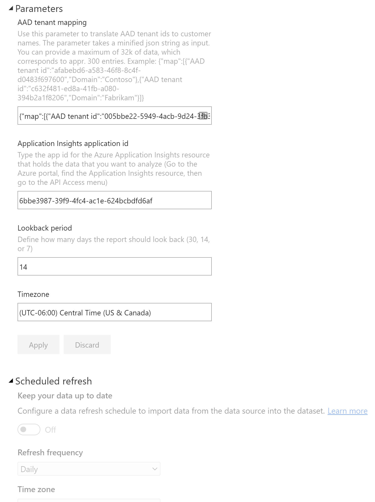

In this folder, you will find the source code for the PowerBI app report on Dynamics 365 SCM telemetry in Azure Application Insights. 

# Power BI prerequisites
The app is not on appsource yet, so you need to allow it to be installed. 

Go to the PBI admin portal.
Under Tenant settings, Go to Template App settings. Here you can enable template apps that are not listed on app source.
Remember to set the setting back after installing the beta version of the app.

# Getting the report
Use this link to install/update the current development version template app (if you want to test bleeding edge): https://aka.ms/scm-app-beta 

The app comes with sample data.

# Connecting to Azure Application Insights
To connect the app to an Azure Application Insights resource, you need one thing: the Application Insights app id (get it from the API Access menu in the Azure Application Insights portal). 

NB! If you get this error "The OAuth authentication method isn't supported for this data source", then please check if the application id is correct. This usually is the root cause for that error.

# Changing parameters after initial configuration
Once you completed the setup of the app, how can you change parameters such as _Application Insights application id_ or _Lookback period_?

You can change configuration settings by going to the Power BI portal, open the workspace for the installed app, go to settings, and then Parameters.

# Sharing the app with coworkers and others
Once installed, it is possible to share the app with coworkers and others (e.g. customers). 

Do this:
1. Share the Power BI workspace with the person. This will make the app appear under _Workspaces_ in their Power BI portal.
2. Provide the url to the person and ask them to open it in a browser. This will make the app appear under _Apps_ in their Power BI portal.

Read more here [Share Power BI reports and dashboards with coworkers and others](https://docs.microsoft.com/en-us/power-bi/collaborate-share/service-share-dashboards)

# Disclaimer
Microsoft Corporation (“Microsoft”) grants you a nonexclusive, perpetual, royalty-free right to use and modify the software code provided by us for the purposes of illustration  ("Sample Code") and to reproduce and distribute the object code form of the Sample Code, provided that you agree: (i) to not use our name, logo, or trademarks to market your software product in which the Sample Code is embedded; (ii) to include a valid copyright notice on your software product in which the Sample Code is embedded; and (iii) to indemnify, hold harmless, and defend us and our suppliers from and against any claims or lawsuits, whether in an action of contract, tort or otherwise, including attorneys’ fees, that arise or result from the use or distribution of the Sample Code or the use or other dealings in the Sample Code. Unless applicable law gives you more rights, Microsoft reserves all other rights not expressly granted herein, whether by implication, estoppel or otherwise. 

THE SAMPLE CODE IS PROVIDED "AS IS", WITHOUT WARRANTY OF ANY KIND, EXPRESS OR IMPLIED, INCLUDING BUT NOT LIMITED TO THE WARRANTIES OF MERCHANTABILITY, FITNESS FOR A PARTICULAR PURPOSE AND NONINFRINGEMENT. IN NO EVENT SHALL MICROSOFT OR ITS LICENSORS BE LIABLE FOR ANY DIRECT, INDIRECT, INCIDENTAL, SPECIAL, EXEMPLARY, OR CONSEQUENTIAL DAMAGES (INCLUDING, BUT NOT LIMITED TO, PROCUREMENT OF SUBSTITUTE GOODS OR SERVICES; LOSS OF USE, DATA, OR PROFITS; OR BUSINESS INTERRUPTION) HOWEVER CAUSED AND ON ANY THEORY OF LIABILITY, WHETHER IN CONTRACT, STRICT LIABILITY, OR TORT (INCLUDING NEGLIGENCE OR OTHERWISE) ARISING IN ANY WAY OUT OF THE USE OF THE SAMPLE CODE, EVEN IF ADVISED OF THE POSSIBILITY OF SUCH DAMAGE.
